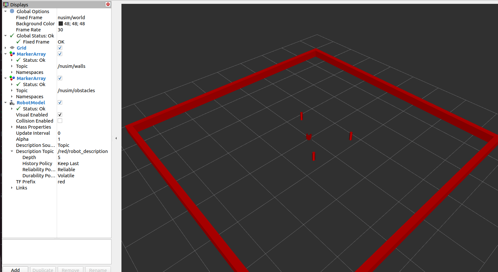

# `nusim` package:
The `nusim` package loads a mapped arena with mapped cylindrical obstacles for the nubot.
It also loads one turtlebot.

## Launchfiles

### `nusim.launch.xml`
- Launches `nuturtle_description` package's `load_one.launch.py` to load one `red` turtlebot.
- Runs `rviz` with a specific configuration:

    1. `rviz_config`: defaults to `nusim.rviz` configured to view the robot, arena and obstacles.
- Runs the `nusim` node to load a world configured by a world yaml file.

    1. `config file`: defaults to `basic_world.yaml` which sets the length, thickness and width of the arena, width and positions of the obstacles, and initial configuration of the robot.

