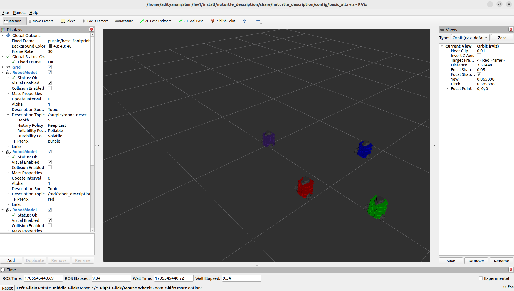

# Nuturtle  Description
URDF files for Nuturtle `Franklin` and `Friends`
* `ros2 launch nuturtle_description load_one.launch.py` to see the robot in rviz.
* `ros2 launch nuturtle_description load_all.launch.xml` to see four copies of the robot in rviz.

* The rqt_graph when all four robots are visualized (Nodes Only, Hide Debug) is:

# Launch File Details
* `ros2 launch nuturtle_description load_one.launch.py --show-args`
    ```
    Arguments (pass arguments as '<name>:=<value>'):

        'use_jsp':
            gui (default): use jsp_gui, jsp: use joint_state_publisher, none: no joint states published
            (default: 'gui')

        'use_rviz':
            true (default): start rviz, otherwise don't start rviz
            (default: 'true')

        'color':
            Color of nuturtle's body. Valid choices are: ['red', 'green', 'blue', 'purple', '']
            (default: 'red')
    ```
* `ros2 launch nuturtle_description load_all.launch.xml --show-args`
  ```
    Arguments (pass arguments as '<name>:=<value>'):

      'use_jsp':
        gui (default): use jsp_gui, jsp: use joint_state_publisher, none: no joint states published
        (default: 'gui')

    'use_rviz':
        true (default): start rviz, otherwise don't start rviz
        (default: 'true')

    'color':
        Color of nuturtle's body. Valid choices are: ['red', 'green', 'blue', 'purple', '']
        (default: 'red')

  ```